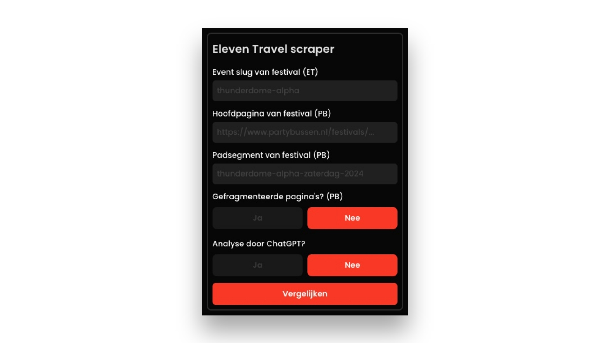

# Eleven Travel scraper

## Inhoudsopgave

1. [Vereisten](#vereisten)
2. [Setup](#setup)
3. [Gebruik](#gebruik)

## Vereisten

Voor dit project is het aan te raden om de volgende software te installeren:

2. **Node.js** – Een JavaScript runtime-omgeving die nodig is om het project te draaien.
   - Download het hier: [Node.js](https://nodejs.org/)
1. **Visual Studio Code (VSCode)** – Een krachtige en veelzijdige editor voor code. Het gebruik van VSCode is optioneel, maar het wordt wel aanbevolen voor een betere ervaring.
   - Download het hier: [Visual Studio Code](https://code.visualstudio.com/)

## Setup

Volg de onderstaande stappen om het project op te zetten:

### Stap 1: Downloaden van het project

1. Ga naar de GitHub-pagina van het project.
2. Klik op de groene knop **"Code"** en kies **"Download ZIP"**.
3. Zet het ZIP-bestand op je bureaublad of een andere locatie op je computer.

### Stap 2: Het project openen in VSCode (optioneel)

1. Open **Visual Studio Code** (VSCode).
2. Sleep de gedownloade folder (de ZIP-bestanden uitgepakt) naar VSCode om het project te openen.
3. VSCode zal nu het project openen en je kunt de volgende stappen uitvoeren.

### Stap 3: Installeren van de benodigde afhankelijkheden

1. Zorg ervoor dat je in VSCode de **Terminal** opent (via **View > Terminal** of `Ctrl + ~`).
2. In de terminal kun je de benodigde afhankelijkheden installeren door het volgende commando uit te voeren:

   ```bash
   npm install
   ```

   Dit installeert alle benodigde afhankelijkheden voor het project.

3. Voer daarna het volgende commando uit om de bestanden te bouwen:
   ```bash
   npm run build
   ```

### Stap 4: Chrome extensie toevoegen

1. Na het uitvoeren van de bouwopdracht, wordt er een `dist` map aangemaakt.
2. Open **Chrome** en ga naar de extensiespagina via `chrome://extensions/`.
3. Zet de "Developer mode" aan rechtsboven in het scherm.
4. Klik op de knop **"Load unpacked"** en selecteer de `dist` map die zojuist is aangemaakt.

### Stap 5: De server draaien

1. Na het toevoegen van de extensie kun je de server starten door het volgende commando uit te voeren in de terminal:
   ```bash
   npm run server
   ```
2. Dit start een lokale server waarop de scraper draait. Je kunt nu het scraperproces testen.

Hier is een herschreven en verbeterde versie van het gedeelte van je README:

## Gebruik

Na een succesvolle installatie van de Chrome-extensie ziet de interface er als volgt uit:



De scraper vereist vijf gegevens om het scrapingproces uit te voeren. Volg de onderstaande stappen om deze informatie te verzamelen:

### **Stap 1: Event slug ophalen**

1. Open de hoofdpagina van het festival op [ElevenTravel.nl](https://eleventravel.nl) en ga naar het overzicht van bustickets, zoals weergegeven in de onderstaande afbeelding.

   

2. Klik met de rechtermuisknop op de pagina en kies **Element inspecteren**. Navigeer naar het tabblad **Network**.

   - Klik op de knop **Toon alle opstaplocaties**.
   - Er verschijnt een nieuw verzoek met de naam `admin-ajax.php` in de kolom **Name**.
   - Klik op dit verzoek om de **event slug** te bekijken.

   

---

### Stap 2: Hoofdpagina van het festival op Partybussen.nl

Ga naar [Partybussen.nl](https://partybussen.nl) en zoek het festival waarvan je gegevens wilt verzamelen. Kopieer de URL van de hoofdpagina uit de adresbalk.

> **Let op:** Zorg ervoor dat je de link van de hoofdpagina kopieert en niet die van een provinciepagina binnen het festival.

---

### Stap 3: Padsegment van het festival op Partybussen.nl

Het padsegment identificeert het specifieke festival in de URL. Bijvoorbeeld:

Uit de volgende URL:  
`https://www.partybussen.nl/festivals/thunderdome-alpha-zaterdag-2024`

is **thunderdome-alpha-zaterdag-2024** het padsegment.

---

### Stap 4: Gefragmenteerde pagina’s op Partybussen.nl?

Controleer of de busprijzen zijn opgesplitst over subpagina’s per provincie.

- Als de prijzen niet direct zichtbaar zijn op de hoofdpagina van het festival, zijn de pagina’s **gefragmenteerd**.
- Een voorbeeld van een gefragmenteerde structuur:

  

Met deze stappen heb je alle benodigde gegevens verzameld om de scraper succesvol te gebruiken.
